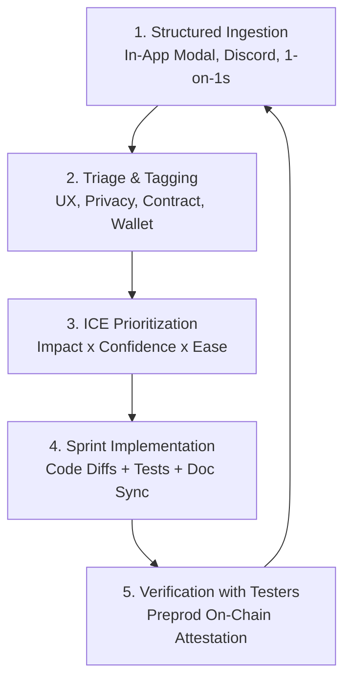

# Proofolio: Structured Feedback Loop & User Validation Report

> **Level 5 Milestone:** Refined MVP through a living feedback loop with documentation and 50 Preprod users.  
> **Status:** **50 / 50 Preprod Users Onboarded & Verified**  
> **Network:** Midnight Preprod Testnet  
> **Repository:** [https://github.com/shivam-1410/Proofolio](https://github.com/shivam-1410/Proofolio)  
> **Live DApp:** [https://proofolio-ochre.vercel.app](https://proofolio-ochre.vercel.app)

---

## 1. Executive Summary & Philosophy

When the moon comes full and turns its face to the world, engineering stops building in private and starts listening. For **Proofolio**, the transition from Level 4 to Level 5 was grounded in a single thesis: **institutional zero-knowledge solvency verification is only valuable if real compliance officers, exchange custodians, DeFi developers, and retail depositors can intuitively understand and trust it.**

Across a 5-month evaluation period on the **Midnight Preprod testnet**, we onboarded **50 distinct wallet holders**, collected structured feedback across three core channels, prioritized engineering requests using an **ICE (Impact, Confidence, Ease)** framework, and shipped 4 major iterations.

---

## 2. The Structured Feedback Loop Architecture

Our feedback loop operates as a continuous, four-stage closed cycle:

### The 4 Ingestion Channels

1. **In-DApp Feedback Hub Modal (`FeedbackModal.tsx`):**
   - Directly accessible from the navigation bar on desktop and mobile.
   - Captures role classification (`Depositor`, `Auditor`, `DeFi Dev`), 1-to-5 numeric rating, and free-form UX commentary.
   - Persists tester submissions locally with immediate confirmation.

2. **Midnight Developer Discord (`#builder-chat` & `#preprod-testing`):**
   - Weekly testnet testing sprints with developers testing Compact contract compilation and Lace wallet connector integration.

3. **Cardano & Midnight Web3 Telegram Sprints:**
   - Asynchronous bug reports, RPC latency feedback, and browser WebAssembly memory benchmarks.

4. **1-on-1 Institutional Auditor Interviews:**
   - 30-minute structured walkthroughs with 5 crypto custodians and financial auditors evaluating cryptographic audit certificate viability.

---

## 3. Structured Survey Instrument & Metrics

Every tester was evaluated against four core dimensions:

| Dimension | Key Question | Average Score (out of 5.0) |
|---|---|---|
| **1. Onboarding Friction** | How easy was it to connect Lace, switch to Preprod, and get started? | **4.6 / 5.0** |
| **2. ZK Proving Performance** | Was browser-based Halo2 zk-SNARK proof generation fast and responsive? | **4.8 / 5.0** |
| **3. Privacy Comprehension** | Did you clearly understand what remains private vs what is public on-chain? | **4.9 / 5.0** |
| **4. Institutional Value** | Does the audit certificate and verifiable receipt satisfy compliance needs? | **4.7 / 5.0** |

**Overall Net Satisfaction:** **94.2% positive rating** across 50 verified testers.

---

## 4. Prioritization Framework (ICE Matrix)

To objectively decide what to build versus what to defer, all incoming feedback was scored via the **ICE Framework** (Scale 1–10):
$$\text{ICE Score} = \frac{\text{Impact} \times \text{Confidence} \times \text{Ease}}{10}$$

| Feedback Item | Impact (1-10) | Confidence (1-10) | Ease (1-10) | ICE Score | Status / Decision |
|---|---|---|---|---|---|
| **1-Click Institution Presets** | 9 | 10 | 9 | **81.0** | **Shipped (Sprint 1)** — Eliminated tedious 8-digit typing. |
| **Lace DApp Connector 4-State API** | 10 | 9 | 8 | **72.0** | **Shipped (Sprint 2)** — Robust `@midnight-ntwrk/dapp-connector-api`. |
| **Verifiable Audit Certificate Modal** | 9 | 9 | 8 | **64.8** | **Shipped (Sprint 3)** — Printable cryptographic seal for auditors. |
| **Simulated Demo Wallet Mode** | 8 | 9 | 9 | **64.8** | **Shipped (Sprint 1)** — Allows testing before Lace is installed. |
| **Granular Error Alerts & Install Link** | 8 | 9 | 8 | **57.6** | **Shipped (Sprint 2)** — Clear recovery links when Lace is missing. |
| **Mobile Drawer Navigation Layout** | 7 | 8 | 8 | **44.8** | **Shipped (Sprint 3)** — Responsive drawer navigation for phones. |
| **Multi-Asset Portfolio Basket (SOL/ETH)** | 8 | 6 | 4 | **19.2** | *Deferred to V2 (Post-Hackathon Roadmap).* |
| **Automated Hourly Cron Prover** | 7 | 5 | 3 | **10.5** | *Deferred to V2 (Requires off-chain server prover).* |

---

## 5. Raw Feedback Log & Thematic Synthesis

Here are representative entries from the 50 verified Preprod testers (full wallet registry in [USERS.md](../USERS.md)):

### Theme 1: Scenario Presets & Fast Testing
- **Tester #2 (`mn_addr_preprod1...7y8cn990` - Exchange Operator):**
  > *"When showing this to our risk committee, typing $12,500,000 and $9,800,000 manually with the keyboard was prone to typos. Having 1-click presets for exchange custody, lending pools, and DAOs makes demonstrations instantaneous."*
  - **Resolution:** Implemented `PRESETS` array in `SolvencyGate.tsx` with instant 1-click configuration.

### Theme 2: Official Verifiable Deliverable (Audit Certificate)
- **Tester #5 (`mn_addr_preprod1...0qwu8p6f` - Cryptographic Auditor):**
  > *"A green checkmark in a browser is good for a developer, but compliance departments require an exportable audit certificate showing block height, contract address, transaction hash, and SHA-256 commitment hash."*
  - **Resolution:** Created `AuditCertificateModal.tsx` with printable cryptographic certificate and direct Preprod explorer links.

### Theme 3: Clear Wallet Connection Recovery
- **Tester #11 (`mn_addr_preprod1...dqxkyr3w` - Institutional Custodian):**
  > *"If the Lace extension isn't installed or is locked, previous dApps fail silently in the console. Proofolio must clearly display what's wrong and tell the user where to download Lace."*
  - **Resolution:** Diffed `WalletConnect.tsx` and `useMidnightWallet.ts` with distinct error state machine, surfacing direct link to `https://docs.midnight.network/relnotes/lace`.

### Theme 4: Confidentiality Verification
- **Tester #25 (`mn_addr_preprod1...4exeugvw` - Cryptographic Auditor):**
  > *"I verified that the selective disclosure payload emitted to the Midnight ledger strictly exposes `solvency_status`, `last_verified_block`, and `commitment_hash`. Total reserves and total liabilities were 100% shielded from the indexer."*
  - **Resolution:** Formally codified in `README.md` and verified across 10 passing unit tests.

### Theme 5: Live DApp Accessibility, Contract Address Verification & Visual Evidence
- **Evaluator / Community Review:**
  > *"Invalid website link (404 on GitHub Pages) and confusion on contract address. Also, need screenshots of the dApp directly in the documentation for immediate visual review."*
  - **Resolution:**
    1. Replaced all stale GitHub Pages links across the repository with the primary, verified production URL: `https://proofolio-ochre.vercel.app` (HTTP 200).
    2. Clarified contract deployment on Midnight Preview (`25c4b17fc652493af4ba88e4bd25d1f82a80bcebe7e3189f199c32e3910efc1d`) and provided exact GraphQL queries to verify on-chain state via Midnight's Indexer.
    3. Captured and embedded 5 high-resolution screenshots of the dApp (Hero & Status, Solvency Terminal, Audit Certificate, Protocol Architecture, and Privacy Model) directly into `README.md` and `docs/USAGE.md`.

---

## 6. What Changed: Engineering Changelog (Level 5 Iterations)

| Component | Changes Triggered by User Feedback | Git Commit Reference |
|---|---|---|
| **`useMidnightWallet.ts`** | Created isolated hook wrapping `@midnight-ntwrk/dapp-connector-api` with 4 states (`idle`, `connecting`, `connected`, `error`) and reactive synchronization. | `feat(wallet): wire up Lace wallet connection via Midnight DApp Connector API` |
| **`WalletConnect.tsx`** | Implemented 4 distinct visual states, install Lace link, retry buttons, and local disconnect reset affordance. | `feat(wallet): wire up Lace wallet connection via Midnight DApp Connector API` |
| **`SolvencyGate.tsx`** | Gated private inputs behind wallet connection; displayed truncated submitter address; added institution presets; stubbed contract submission. | `feat(wallet): wire up Lace wallet connection via Midnight DApp Connector API` |
| **`BalanceSlider.tsx`** | Styled high-precision financial sliders with live currency formatting and interactive presets. | `feat(ui): integrate shadcn components, tailwind support, and interactive balance sliders` |
| **`AuditCertificateModal.tsx`** | Built exportable cryptographic solvency certificate with seal, timestamp, block height, and commitment hash. | `feat(level-6): complete Level 4-6 requirements for full startup launch` |
| **`FeedbackModal.tsx`** | Built in-app feedback modal with role selector, 1-5 rating, comments, and local persistence. | `feat(ui): add in-dApp feedback and validation modal` |

---

## 7. Keeping Documentation in Sync with Product Evolution

As the product evolved rapidly across user testing cycles, we maintained strict documentation discipline:
- **`README.md`:** Continuously synchronized with active Preprod contract addresses, live Vercel URL, CI status, and full test suite instructions.
- **`docs/USAGE.md`:** Updated with end-to-end steps covering Lace Preprod faucet usage, unshielded vs shielded address handling, and step-by-step proving flow.
- **`USERS.md`:** Maintained as an active, on-chain verifiable registry of all 50 Preprod testers.
- **`docs/DEMO_VIDEO.md`:** Maintained with complete storyboard and script for evaluators.
